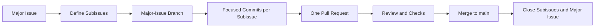

# Engineering Workflow

This document defines how maintainers, contributors, and coding agents plan and deliver changes to LLM AuditKit.

## Core Workflow

All implementation work starts from a GitHub issue and reaches `main` through a reviewed pull request.



The `main` branch should remain installable and should not be used directly for feature development.

## Issue Hierarchy

Create one major issue for each pipeline stage:

1. Dataset loading
2. Shared inference
3. Template generation
4. Template population
5. Experiment execution
6. Regression analysis

Major issues describe the stage-level goal, link the relevant architecture documentation, list dependencies, and collect their subissues. Each major issue normally receives one branch and one pull request containing all of its subissue work.

Create subissues for bounded units of work such as:

- a configuration model or cohesive group of related models;
- a loader, validator, store, adapter, or orchestration component;
- integration between two documented components;
- tests for a defined behavior or contract;
- documentation required by an implementation change.

A class does not automatically require its own subissue. Split work where it creates a useful planning, implementation, or review checkpoint; keep tightly coupled classes in the same subissue.

Subissues do not receive separate branches or pull requests by default. Make an exception when a subissue must be developed or reviewed independently, when multiple contributors need to work in parallel, or when the major-issue pull request would otherwise become impractically large.

## Issue Readiness

A major issue is ready for development when it contains:

- context and motivation;
- a clearly bounded scope;
- explicit out-of-scope items;
- acceptance criteria;
- links to relevant architecture documents and diagrams;
- known dependencies or blocking issues;
- expected tests and documentation changes.

Each subissue should have a bounded outcome and acceptance criteria sufficient to determine when its part of the major issue is complete. If requirements are materially ambiguous, resolve them before implementation rather than inventing behavior on a branch.

## Branches

Create one branch from the latest `main` for each major issue.

Use this naming convention:

```text
<category>/<issue-number>-<short-description>
```

Examples:

```text
feat/10-experiment-execution
feat/11-shared-inference
docs/12-engineering-workflow
```

Recommended categories are `feat`, `fix`, `docs`, `refactor`, `test`, and `chore`. When an agent environment requires its own namespace, retain the major issue number and description, for example `codex/10-experiment-execution`.

Do not create a branch for each subissue by default, and do not combine unrelated major issues on one branch. If a discovered change falls outside the major issue scope, open or propose a separate issue.

## Implementation

Before editing:

1. Read the major issue and all subissues currently in scope.
2. Read `AGENTS.md` and the linked architecture documentation.
3. Confirm the major issue is not blocked and coordinate with anyone else working on its branch.
4. Update the local `main` branch and create the major-issue branch from it.

During implementation:

- keep changes within the issue scope;
- add or update tests with behavior changes;
- update prose and diagrams when architectural contracts change;
- make a focused commit for each completed subissue, or a small cohesive series when one commit would be misleading;
- reference the subissue number in its commit subject, for example `Add inference configuration (#42)`;
- record newly discovered follow-up work in separate issues instead of expanding scope silently.

## Testing per Commit

Every commit that introduces or changes runtime behavior must add or update unit tests covering that behavior. Keep the implementation and its tests in the same subissue commit, or in the same cohesive commit series when separating them would make the history misleading.

Before committing a behavior change:

1. Run the new or directly affected tests.
2. Run the complete existing test suite.
3. Confirm the commit intended for review does not knowingly leave tests failing.

Place tests under `tests/` and organize them to reflect the corresponding package areas under `src/llm_auditkit/`. Bug fixes must include a regression test that fails without the fix. Mock Expected Parrot EDSL and external model calls; unit tests must not require credentials or network access.

Documentation-only, formatting, and repository-organization commits do not require artificial unit tests. Run the checks relevant to the files they change instead.

No test runner is configured yet. The first implementation work that introduces executable behavior must establish the test setup and add the exact targeted-test and full-suite commands to `AGENTS.md` and this document.

## Pull Requests

Open a draft pull request early when feedback or coordination would be useful. Mark it ready for review only after the acceptance criteria are satisfied and relevant checks pass.

Every pull request should include:

- a concise summary of the change;
- a link to the major issue;
- a checklist of its subissues;
- `Closes #<subissue-number>` for every subissue completed by the pull request;
- `Closes #<major-issue-number>` when the pull request completes the entire major issue;
- important design decisions or deviations from the issue;
- tests and verification performed;
- documentation changes;
- known limitations or follow-up issues.

Do not close subissues merely because their commits have been pushed. Keep them open until the pull request merges so the issue state reflects what is available on `main`. If a pull request does not complete all required subissues, omit the major issue's closing keyword and leave it open for follow-up work.

## Review and Merge

Reviewers should verify:

- the implementation satisfies the linked issue and acceptance criteria;
- the change follows `AGENTS.md` and the documented architecture;
- tests cover the changed behavior without live model calls;
- public interfaces and dependencies are intentional;
- documentation and diagrams remain synchronized;
- unrelated changes are not included.

Address review feedback on the same major-issue branch. Prefer a merge method that preserves the focused subissue commits, such as rebase-and-merge or a merge commit. Avoid squash merging when retaining the subissue-level history is useful. Delete the branch after merging.

## Agent Coordination

Coding agents follow the same issue and pull-request workflow as human contributors.

- Assign or otherwise claim a major issue or one of its subissues before starting work.
- Coordinate all contributors and agents working on the shared major-issue branch; avoid overlapping edits.
- Provide the major issue, assigned subissue, and architecture links in the task context.
- Do not let an agent work directly on `main`.
- Require agents to report changed files, verification performed, and remaining limitations.
- Review agent-generated changes before merging them.

## Completion

A subissue is complete when its acceptance criteria are satisfied, its changes are included in the merged major-issue pull request, and any follow-up work is recorded separately.

A major issue is complete when all required subissues are closed, their changes are integrated on `main`, and the stage-level documentation and acceptance criteria are current.
